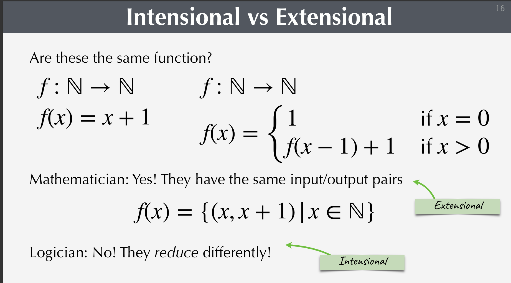
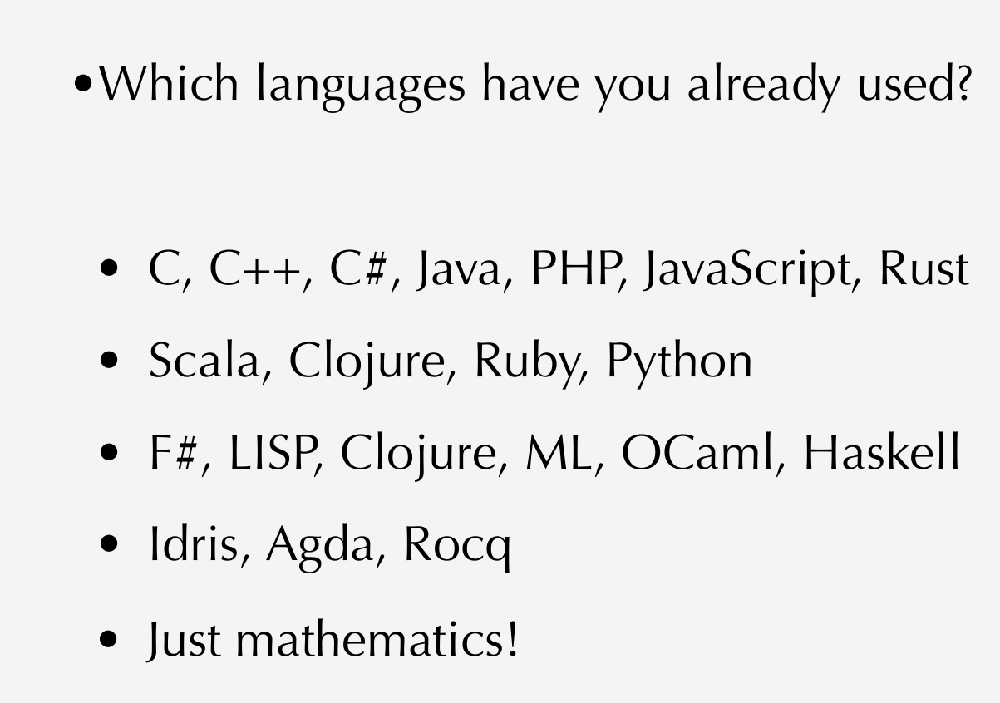

#### **First Haskell Lecture!!**

Intentional vs Extensional

In Computer Science, extensional and intentional functions will reduce differently - although they give you the exact same answers for all (input, output) pairs, they do NOT use the same approach.

- Mathematics typically uses extensional functions, looking at mappings from input to output only
- Computer Science uses intentional functions, looking at the mapping itself.


Church's Lambda Calculus was designed to think about reductions systematically. To see how long they take to reduce.

- He showed that all numbers can be reduced to his calculus form.


In maths a function associates an output value for each value in the input 

```
f: N -> N
f(x) = x + 1
```

```Haskell
--all fucntions in haskell must start with lowercase letter
succy :: integer -> integer;
succy x = x + 1; 

--haskell is very case sensitive
-- all type names have first letter capitalsied 
```




These programming languages gain abstraction going down the list:




Recommended literature for Haskell
----------------------------------

- learnyouahaskell.com
- tryhaskell.org
- book.realworldhaskell.org.read
- tryhaskell.org
- Programming in Haskell (2nd Ed) by Graham Hutton
- Thinking Functionally with Haskell
