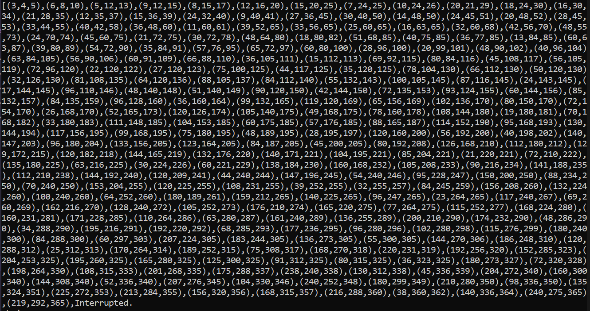

# **Haskell Lecture 3 - Lambda Abstraction**

*"When I Use a word, it means just what I choose it to mean - neither more, nor less" -- Humpty Dumpty, Lewis Carroll*

## Lambda Abstraction

Need ton consider what a function actually is. In Matehmatics, it is a map of input values onto output values and must be injective, surjective or bijective - not many-to-many, nor one-to-many

```Haskell
f :: a -> b
f x = y
```

We can use lambda expressions to isolate the function more clearly. You can talk about the right hand side of the equation without talking about the left hand side. This means we are no longer forced to name a function - we can use it without first declaring what it is.

```Haskell
f :: a -> b
f = \lambda x -> y
```

Consider diference between the following add, plus functions:

```Haskell
add :: Int -> Int -> Int
add x y = x + y
-- there is an advantage to this version because we can 
-- use it to do partial function application

--now compare it to thisone
plus :: (Int,Int) -> Int
plus (x,y) = x + y
```

USing the second version, plus function, you will need both

The definition of add allows for** *partial application.* **

add x y = x + y <==> add x = \lambda y -> x + y

Type of add x is Int -> Int.

```Haskell
add :: Int -> Int -> Int
add x :: Int -> Int
add x y :: Int

--in other words this works because 
a -> b -> c = a -> (b -> c)
```

```Haskell
--function composition using lambda expressions


-- add funtion with lambda expressions
add = \lambda x -> (\lambda y -> x+y)
    = \lambda x y -> x + y
    -- both of these notations are permitted here and are equivalent
```

## Currying

This kind of comes from the principle that (a,b) -> c ~= a -> b -> c is **isomorphic** (they are the same, ***these are just two different ways of writing the function, and are equivalent***. We can convert freely between them).

The curry function takes a function that takes a pair and converts it into a standard Haskell function that takes two arguments.

```Haskell
curry :: ((a,b) -> c) -> a -> b  -> c
curry f x y = f(x,y)
-- f takes in a pair of style (a,b) and produces a result

--currying will initially take in the function which maps
-- maps (a,b) -> c, and then a->b->c

--this is like a transformation of a tupling function

uncurry :: (a -> b -> c) -> ((a,b) -> c)
uncurry g(x,y) = g x y
```

if we were to write the curry function using a lambda expression it would look like this:

```Haskell
--curry
\lambda x y -> f(x,y)

--uncurry
\lambda (x,y) -> g x y
```

Here is an example

```Haskell
pairAdd :: (Int,Int) -> Int
pairAdd = uncurry add


--going through an example
pairAdd(1,2) = 3
```

PROVE curry . uncurry = identity function AND uncurry . curry = identity function (use pattern matching for proof)

### Significance of currying

Not every programming language has this correspondence between a tuple and two parameters. Very few languages!

## (Aside): Higher order Functions

Ability to express **first class functions** - functions give outputs and these outputs mean that the function (with the parameters passed) can essentailly be treated the same as actual values themselves.

**Higher order functions** - a function that takes in a function as an argument. This relies on the key idea that

## Datatypes

In haskell, you can declare new datatypes. For instance this is how you would declare bools:

```Haskell
data Bool where
     True :: Bool
     False :: Bool
```

You can use this structure to define your own datatypes.

```Haskell
data Day where
	Monday :: Day
    Tuesday :: Day
    Wednesday :: Day
    Thursday :: Day
    Friday :: Day
    Saturday :: Day
    Sunday :: Day
```

Now you can use this new data type you created to create a function.

```Haskell
weekend :: Day -> Bool
weekend Monday = False
      .
      .
      .
      .
weekend Saturday = True
weekend Sunday = True

-- you cant actually use guards for this
-- because guards need a condition whcih we havent yet defined
-- wheresa pattern matching doesnt need a condition
-- whcih is why pattern matching is preferred
```

## Recursive Data Structures

```Haskell
data  Natural where
      Zero :: Natural
      Succ :: Natural -> Natural
      deriving(Show,Eq) --this can be used if you are lazy because whta it does is 9complete

--we can define our own fucntions over natural
-- they should use the same symbols as those for floats
```

### Ad Hoc Polymorphism

We cannot check every data type for equality eg functions. You can define the collatz c

If equality over functions existed, then the Halting Problem would be solved, since we could compare ig a program equalled a function that was known to halt.

We can't compare all values, even if tehy have the same type. Functions cannot be compared.

### Typeclasses

A type class describes a family of

```Haskell
class Eq a where
     (==) :: a -> a -> Bool

-- the eq class already exists in haskell.
-- we can make natural an instance f the eq class
```

we can make Natural an instance of this class:

```Haskell
instance Eq Natural where
       (==) :: Natural -> Natural -> Bool

       Zero == Zero = True
       Succ m == Succ n = m == n
       Succ m == Zero = False
       Zero == Succ n = False
```

Another class is the Num class

```Haskell
class Num a where
      (+) :: a -> a -> a
      (*) :: a -> a -> a
      (-) :: a -> a-> a
		      .
              .
              .
      fromInteger :: Integer -> a
```

Likewise, from Integral can be used too!

You can use ghci :i Num to find the  num class and    you can use :i 42::Nums

## Haskell Lists

Everything inside a list has the same type, unlike a tuple where they can have different types (these are known as _heterogenous collections_). Lists are thus *_homogenous collections of unbounded length._*

```Haskell
[1,2,3] :: [Int]
[3.14,1.618,6.28] :: [Float]
[True,False,True] :: [Bool]

[[],[1],[1,2]] :: [[Int]]

--the following are all valid because the list provided is the emtpty list. is this polymorphic?
[] :: [Int]
[] :: [Bool]
[] :: [Double]

--this is also valid, because the empty list is polymorphic which is great
[] :: [[Int]]
[] :: [[[Int]]]
[] :: [[[[Int]]]] --these are all valid!
```

### List Comprehension

Haskell is not afraid of dealing with infinitely large lists!ghci

```Haskell
[1..10] :: [Int]
= [1,2,3,4,5,6,7,8,9,10]

-- we can also construct lists from lists
-- eg pythagorean triples a^2 + b^2 = c^2

pythagoreans :: [(Integer,Integer,Integer)]
pythagoreans = [(a,b,c) | c <- [1..], b <- [1..c], a <- [1..b], a^2 + b^2 == c^2]

-- this is kind of three seaprate comprehensions with one final condition at the end 
-- the final condition is a^2 + b^2 = c^2 which must be satisfied for this to be a pythagorean triple 
-- and the comprehension is how we pick a,b,c. c is the largest side so b must be smaller than c and a must be
--smaller than b
```

this is what happened when I tried to generate this in ghci:



## Other Data Types: Strings, etc


## Type Synonyms

`type`is used to create shorthand for complex types. Unlike `newtype` and `data` it does NOT create a new type. It only gives the existing type an alternative name 

A type synonym gives n alterantive name to an existing type. Use these carefully as they can hide detail that we do not want to hide.

We use `type` when we want the types to be interchangeable

```Haskell
type Username = String
type Age = Int
type Email = String
type User = (Username,Age,Email)

-- the above is a lot more usable than

findUser :: [(String,Int,String)] -> String -> Int -> String
```


Strings are a `type alias` for a list of characters. 

## Questions

1. so this essentally is all dependent on the fact that (a,b) -> c is isomorphic to (a ->b ->c)
2. when defining the type annotation of curry is ((a,b) -> c)) -> (a -> b -> c) the same as ((a,b) -> c) -> a -> b -> c? Can we write either
3. So when we write \lambda this is sort of signalling the beginning of the function
4. I don't really get recursive data structures. i thought succ is a function, what is zero??
5. so then is the difference between a list and a set that a list is ordered adna  set is unordered?
6. is the empty list polymorphic?
7. can we define polymorphic functions with typeclasses? how?
